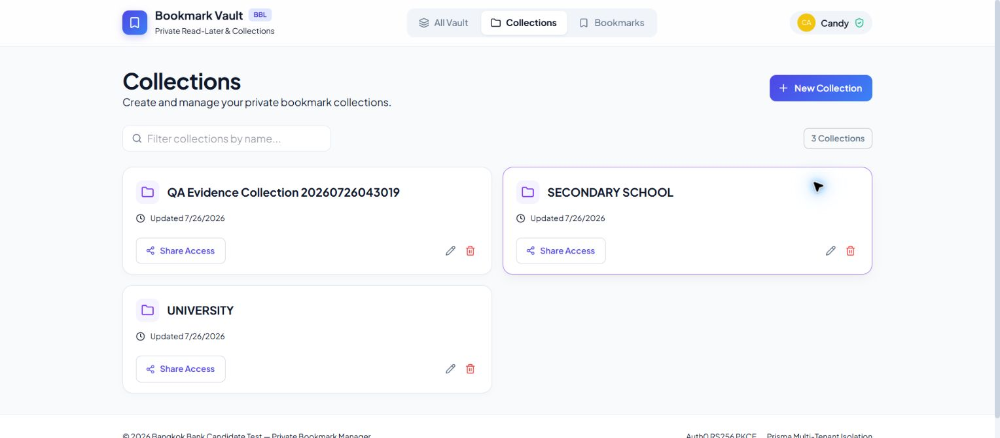
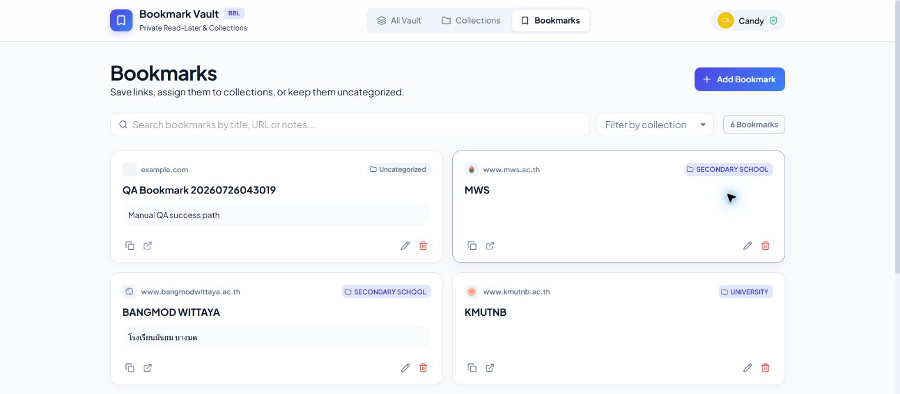
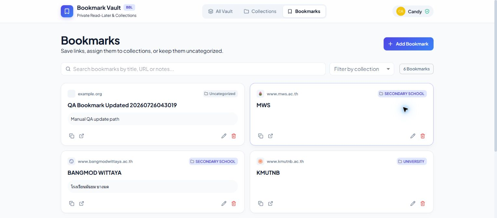
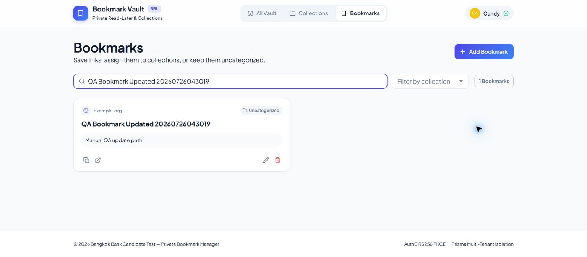
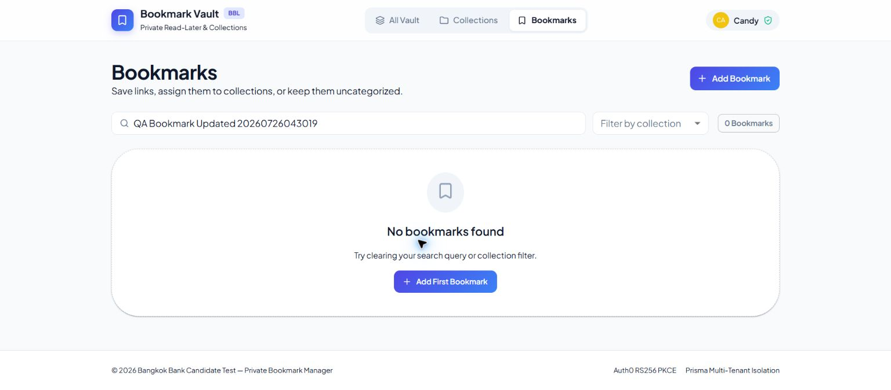
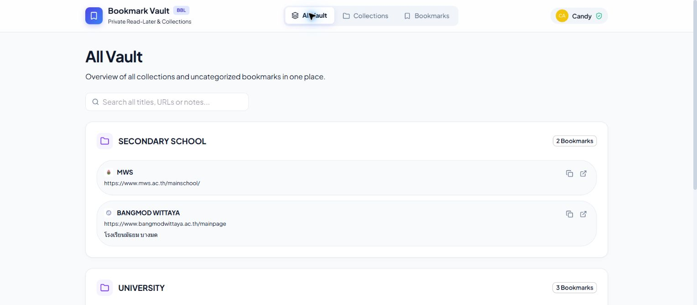
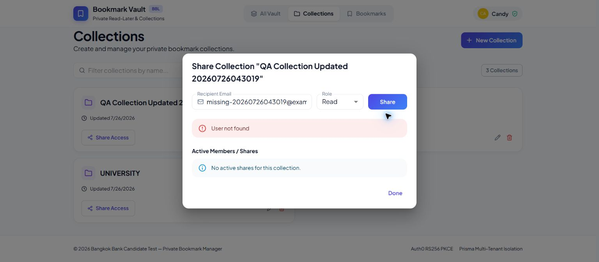
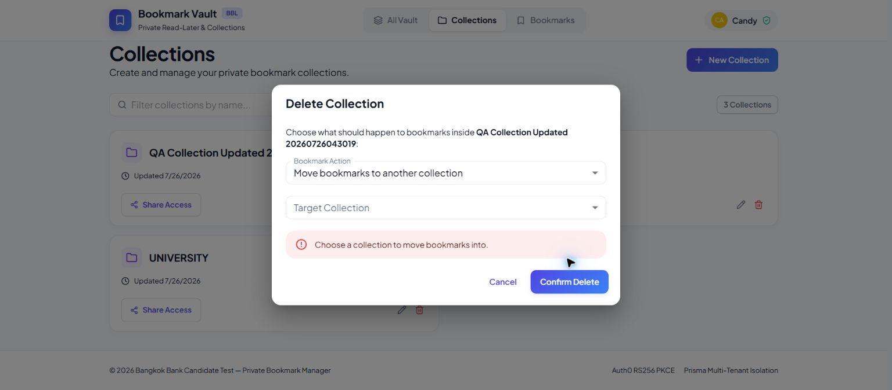
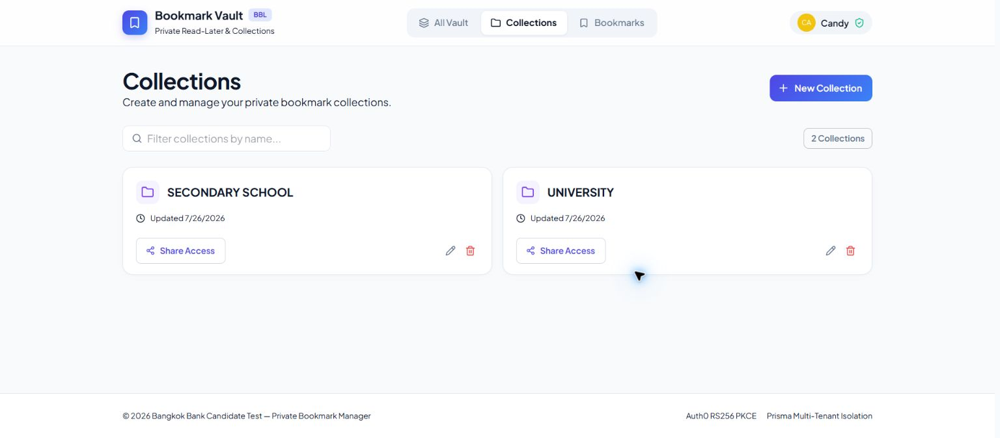

# BBL Bookmark Manager

A private read-later bookmark manager built for the Bangkok Bank full-stack developer take-home exercise.

The app lets a signed-in user create collections, save bookmarks, organize links, search across saved content, and share a collection for read-only access. The main product rule is privacy: a user must not see, edit, delete, or infer another user's private data unless a collection has been explicitly shared with them.

## What Is Implemented

- Auth0 login/logout with Authorization Code + PKCE.
- NestJS API protected by Auth0 access-token validation.
- Prisma-backed SQL persistence with users, collections, bookmarks, and collection shares.
- Owner-scoped collection CRUD.
- Owner-scoped bookmark CRUD.
- Collection deletion flow that asks what to do with contained bookmarks.
- Read-only collection sharing by known user email.
- `/all` grouped vault view across owned and shared collections.
- Search and filtering for bookmarks and collections.
- Frontend loading, empty, signed-out, API error, action error, and root crash fallback states.
- Dockerfiles, Docker Compose, and GitHub Actions workflow.

## App Flow

1. The user signs in through Auth0.
2. The frontend requests an Auth0 access token for `https://bbl-candidate-test-api`.
3. The backend validates issuer, audience, signature, algorithm, and expiry.
4. The backend uses the Auth0 `sub` claim as the canonical user id.
5. Collections and bookmarks are always queried with an owner predicate.
6. Sharing creates a `CollectionShare` record for a known user email.
7. Shared users can read the shared collection and its bookmarks, but mutations remain owner-only.
8. Unknown or private resources return `404` to avoid leaking existence.

## Project Shape

```text
backend/      NestJS API, Auth0 guard, Prisma services, e2e tests
frontend/     Vite React app, MUI UI, Auth0 client integration
docs/         Ticket notes and manual QA screenshots
.agent/       Reusable agent workflow assets
transcripts/  Session notes and prompt history
```

## Tech Stack

- Node.js `>=22.22.0` recommended by the repo.
- Backend: NestJS, TypeScript, Prisma, SQLite for local development.
- Frontend: React 19, Vite 8, React Router 8, MUI 9, Auth0 React SDK.
- Tests: Vitest and Supertest for backend e2e coverage; Playwright for real-browser frontend E2E flows.

## Install

```bash
npm install
```

## Configure

Create a `.env` from `.env.example` if needed. The app expects the provided Auth0 tenant settings:

```text
Auth0 domain: dev-yg.us.auth0.com
API audience: https://bbl-candidate-test-api
Callback URL: http://localhost:3000/callback
Logout URL: http://localhost:3000
```

## Deployment Environment Variables

Sensitive deployment values are not committed to this repository. Add them manually in the platform that uses them.

### Local development

Create or update local `.env` files from the checked-in examples:

- Root `.env`: shared Auth0 URLs, frontend/backend URLs, and default database URL.
- `backend/.env`: backend runtime values such as `PORT`, `DATABASE_URL`, `AUTH0_ISSUER`, `AUTH0_AUDIENCE`, and `AUTH_MODE`.
- `frontend/.env`: Vite/Auth0 values for local frontend builds, if you need to override defaults.

Playwright E2E also needs these local shell variables before running `npm run test:e2e`:

```text
E2E_AUTH_EMAIL=<Auth0 test user email>
E2E_AUTH_PASSWORD=<Auth0 test user password>
```

### GitHub Actions

Add these in GitHub repository settings under `Settings -> Secrets and variables -> Actions`.

Repository secrets:

```text
CLOUDFLARE_ACCOUNT_ID=<Cloudflare account id>
CLOUDFLARE_API_TOKEN=<Cloudflare API token with Pages deploy access>
RENDER_BACKEND_DEPLOY_HOOK_URL=<Render deploy hook URL>
E2E_AUTH_EMAIL=<Auth0 test user email>
E2E_AUTH_PASSWORD=<Auth0 test user password>
```

Repository variables:

```text
ENABLE_CLOUDFLARE_PAGES_DEPLOY=true
CLOUDFLARE_PAGES_PROJECT_NAME=bbl-bookmark-manager
ENABLE_RENDER_BACKEND_DEPLOY=true
VITE_API_BASE_URL=<frontend build API base URL>
VITE_AUTH0_DOMAIN=dev-yg.us.auth0.com
VITE_AUTH0_CLIENT_ID=<Auth0 SPA client id>
VITE_AUTH0_AUDIENCE=https://bbl-candidate-test-api
```

The workflow gates Cloudflare Pages deployment behind `frontend_e2e`. If Playwright fails or the E2E Auth0 secrets are missing, `deploy_frontend` will not run.

### Cloudflare Pages

The current Pages project is deployed by GitHub Actions through `wrangler pages deploy`. Keep Cloudflare's native Git integration disconnected, or disable its auto deploys if you connect it later, otherwise Cloudflare can deploy directly on push without waiting for GitHub Actions tests.

Project name:

```text
bbl-bookmark-manager
```

### Render backend

Add these in the Render Web Service environment settings:

```text
NODE_ENV=production
PORT=3001
DATABASE_URL=file:/data/dev.db
FRONTEND_URL=https://bbl-bookmark-manager.pages.dev
AUTH0_ISSUER=https://dev-yg.us.auth0.com/
AUTH0_AUDIENCE=https://bbl-candidate-test-api
AUTH_MODE=auth0
```

Render Auto Deploy should stay off when GitHub Actions is responsible for CI-gated backend deploys through the Render deploy hook.

## Database

Generate Prisma Client and bootstrap the local SQLite database:

```bash
npm run db:generate --workspace backend
npm run db:bootstrap --workspace backend
npm run db:seed --workspace backend
```

The default local database is `backend/prisma/dev.db`. Local development currently uses `db:bootstrap` because Prisma's schema engine failed on this Windows machine with a blank engine error.

## Run Locally

Start the backend and frontend in separate terminals:

```bash
npm run dev:backend
npm run dev:frontend
```

Defaults:

- Frontend: `http://localhost:3000`
- Backend: `http://localhost:3001`

## Test And Build

Run backend tests from the root:

```bash
npm test
```

Run frontend Playwright E2E tests against the real Auth0 tenant:

```powershell
$env:E2E_AUTH_EMAIL="candidate@test.com"
$env:E2E_AUTH_PASSWORD="<password from the PDF brief>"
npm run test:e2e
```

The E2E suite logs in through Auth0 once, stores temporary browser state under `frontend/.auth/user.json`, and then runs action tests for:

- signed-in app shell,
- collection create/update/delete,
- bookmark create/update/search/delete,
- collection error states,
- All Vault grouped read view.

For a headed browser run:

```powershell
$env:E2E_AUTH_EMAIL="candidate@test.com"
$env:E2E_AUTH_PASSWORD="<password from the PDF brief>"
npm run test:e2e --workspace frontend -- --headed
```

Build both workspaces:

```bash
npm run build
```

Frontend build can also be run directly:

```bash
npm run build --workspace frontend
```

Note: component-level frontend Vitest tests are not included yet. Frontend verification currently uses Playwright E2E, TypeScript/Vite build, and manual browser QA screenshots.

## Docker

Build and run both services locally:

```bash
docker compose up -d --build
```

Frontend is served at `http://localhost:3000`.
Backend is served at `http://localhost:3001`.
SQLite data is stored in the `backend-data` Docker volume at `/data/dev.db`.

## API Summary

All API routes require `Authorization: Bearer <access_token>` unless documented otherwise.

- `GET /me`: current signed-in user.
- `GET /collections`: list owned collections.
- `GET /collections?scope=shared`: list collections shared with the current user.
- `POST /collections`: create collection.
- `PUT /collections/:id` / `PATCH /collections/:id`: update collection.
- `DELETE /collections/:id`: delete collection with optional bookmark handling action.
- `POST /collections/:id/shares`: share collection with a known user.
- `GET /collections/:id/shares`: list collection shares.
- `DELETE /collections/:id/shares/:shareId`: revoke a share.
- `GET /bookmarks`: list owned bookmarks.
- `GET /bookmarks?q=term`: search owned bookmarks.
- `POST /bookmarks`: create bookmark.
- `PUT /bookmarks/:id` / `PATCH /bookmarks/:id`: update bookmark.
- `DELETE /bookmarks/:id`: delete bookmark.
- `GET /collections/:id/bookmarks`: read bookmarks for an owned or shared collection.

See [API_DESIGN.md](./API_DESIGN.md) for details.

## Manual QA Evidence

Manual browser QA was run in Chrome against `http://localhost:3000` while signed in as `Candy Candy`. The QA data used timestamped names, and the created QA collection/bookmark were deleted after verification so the original seed data remained intact.

### Success Flows

1. Collection create: opened Collections, created a timestamped QA collection, verified it appeared in the grid, then cleaned it up.
   

2. Bookmark create: opened Bookmarks, created an uncategorized QA bookmark, and verified the new card appeared.
   

3. Bookmark update: edited the QA bookmark title, URL, and notes, then verified the updated values appeared.
   

4. Bookmark search/read: searched by the updated QA title and verified exactly one matching bookmark was displayed.
   

5. Bookmark delete: deleted the QA bookmark and verified the filtered view moved to the empty state.
   

6. All Vault read view: opened All Vault after CRUD cleanup and verified the grouped collection/bookmark view still loaded correctly.
   

### Error Flows

1. Share unknown user: opened Share Access for a QA collection, entered an email that does not exist, and verified the backend error is shown inline as `User not found`.
   

2. Delete collection validation: selected `Move bookmarks to another collection` without choosing a target collection and verified the inline validation message.
   

3. Collection delete success after validation: cancelled the invalid delete attempt, confirmed delete with a safe action, and verified the QA collection disappeared while existing collections remained.
   

## Error Handling Notes

The frontend now handles user-facing failures in three layers:

- Initial page loads show loading, empty, signed-out, or error states.
- Mutating actions such as bookmark save/delete and collection share/delete show inline `Alert` feedback.
- A root `AppErrorBoundary` prevents unexpected React render crashes from becoming a blank page.

The API client also parses NestJS error bodies so users see messages such as `User not found` instead of generic status text.

## Auth And Test Users

Real browser login uses the provided Auth0 tenant. The brief provides one known account: `candidate@test.com`.

Playwright E2E uses that real Auth0 account through environment variables. Do not commit the password or generated `frontend/.auth/user.json` storage state.

For API smoke tests and cross-user checks, run the backend in deterministic test auth mode:

```powershell
$env:AUTH_MODE="test"
npm run dev:backend
```

Example bearer tokens:

```text
Bearer test:auth0|user-a
Bearer test:auth0|user-b
```

This allows backend tests to prove owner isolation and sharing behavior without requiring two real Auth0 users.


## Product Invariant

A user must not see, edit, delete, or infer the existence of another user's private data unless explicit sharing grants read access to a collection.

Supporting docs:

- [REQUIREMENTS.md](./REQUIREMENTS.md)
- [API_DESIGN.md](./API_DESIGN.md)
- [DECISIONS.md](./DECISIONS.md)
- [AI_WORKFLOW.md](./AI_WORKFLOW.md)
